  

## About me

I'm fascinated by the gap between a great idea and a system that actually holds up at scale. That gap is where I like to work.

I recently finished my MS in Computer Science at San José State University, where my research on image-based malware classification became a co-authored paper, now under review. Before grad school I was a software engineer on an EdTech platform serving 70K+ users, chasing down latency and shipping features thousands of learners used every day.

Outside of work I take systems apart to understand them. Lately that meant writing a vector search engine from scratch in C++, then building an LLM gateway and a movie recommender on top of it. I ship something small almost every day; building is how I learn.

Open to full-time Software, ML, and AI Engineering roles across the US.

## Tech stack

## Things I've built

| Project | The short version | Code |
| :-- | :-- | :-- |
| [Proxima](https://sushantlokhande.me/projects/proxima/) | A C++ vector search engine that answers queries 1.8× faster than hnswlib and 2.5× faster than FAISS at 0.999 recall | [repo](https://github.com/sushantlokhande14/proxima) |
| [Relay](https://sushantlokhande.me/projects/relay/) | An LLM gateway that remembers: 78% of requests served from a semantic cache, median latency 759 ms to 44 ms | [repo](https://github.com/sushantlokhande14/Relay) |
| [Reel Rank](https://sushantlokhande.me/projects/reelrank/) | A two-stage hybrid movie recommender with retrieval running on Proxima, answering free-text requests like "a slow-burn sci-fi like Arrival but funnier" | [repo](https://github.com/sushantlokhande14/reelrank) |
| [Autograde AI](https://sushantlokhande.me/projects/autograde-ai/) | A local-first multi-agent grading platform: six grader agents under Temporal and Kafka, confidence-gated human review | [repo](https://github.com/sushantlokhande14/autograde-ai) |
| [Malware Classification](https://sushantlokhande.me/projects/malware-classification/) | My thesis: malware binaries rendered as images, a three-track ensemble that agrees 94% of the time across 17 families | [repo](https://github.com/sushantlokhande14/Soft_Voting_Ensembled_Malware_Images_Classification) |

## Open source

Ten patches merged into projects I don't own, with three more in review.

| Project | What I changed | PRs |
| :-- | :-- | :-- |
| [**NVIDIA/garak**](https://github.com/NVIDIA/garak)   LLM vulnerability scanner | Merging scan reports stamped the run id over every attempt's own UUID, collapsing nine distinct results into a single identity and leaving every cross-reference to them dangling | [#2158](https://github.com/NVIDIA/garak/pull/2158)   in review |
| [**google/osv-scalibr**](https://github.com/google/osv-scalibr)   the scanning engine behind osv-scanner | The ITIN detector's pattern matched space-separated numbers, but its validator never stripped the spaces, so every one of them was silently discarded | [#2405](https://github.com/google/osv-scalibr/pull/2405)   in review |
| [**fission/fission**](https://github.com/fission/fission)   serverless on Kubernetes | Stopped a double enumeration of cluster-wide packages, and taught support dumps to capture KEDA objects and pod events | [#3668](https://github.com/fission/fission/pull/3668) [#3670](https://github.com/fission/fission/pull/3670) [#3671](https://github.com/fission/fission/pull/3671)   merged |
| [**corsairdev/corsair**](https://github.com/corsairdev/corsair)   integration platform | Swept a fail-open family across seven webhook integrations, where a missing secret or an empty payload was accepted as authentic | [#608](https://github.com/corsairdev/corsair/pull/608) [#609](https://github.com/corsairdev/corsair/pull/609) [#610](https://github.com/corsairdev/corsair/pull/610) [#611](https://github.com/corsairdev/corsair/pull/611) [#626](https://github.com/corsairdev/corsair/pull/626) [#627](https://github.com/corsairdev/corsair/pull/627) [#629](https://github.com/corsairdev/corsair/pull/629)   merged |
| [**Significant-Gravitas/AutoGPT**](https://github.com/Significant-Gravitas/AutoGPT)   agent platform | Raised a stale max-output-token ceiling in the backend model catalog | [#14139](https://github.com/Significant-Gravitas/AutoGPT/pull/14139)   in review |

